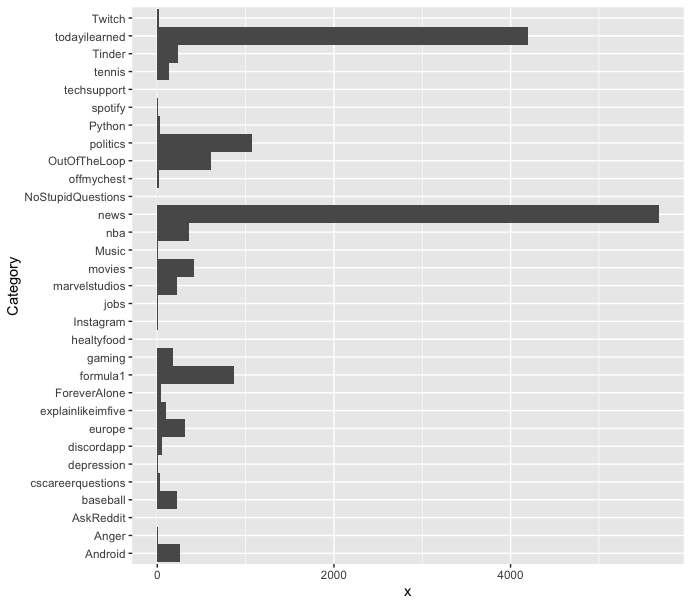
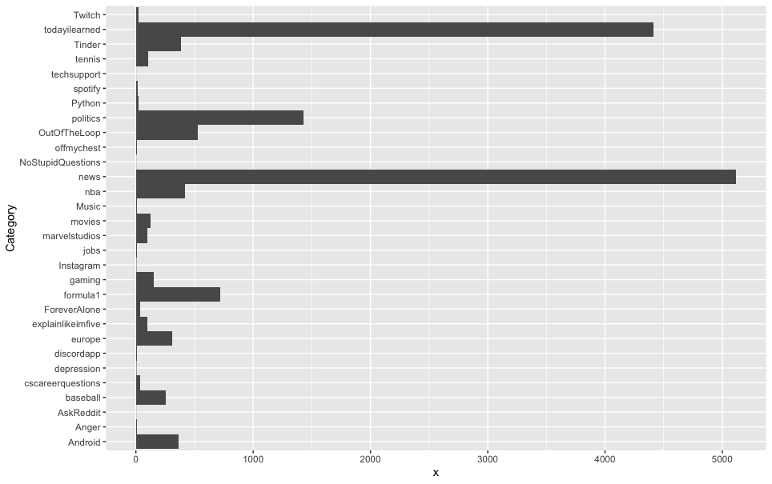
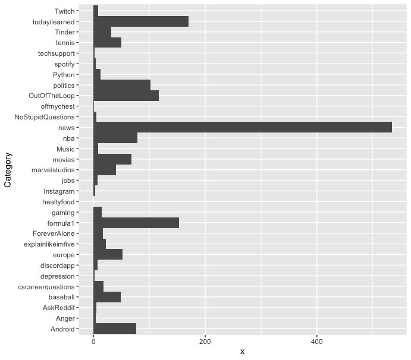
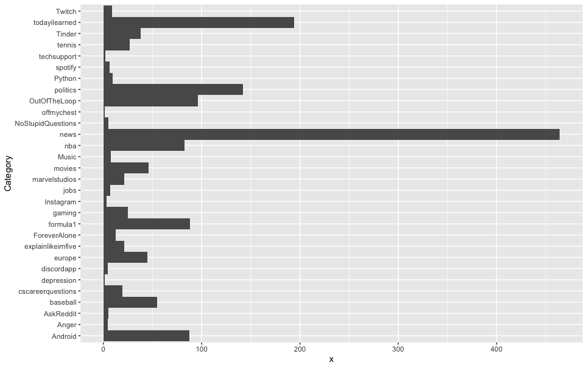
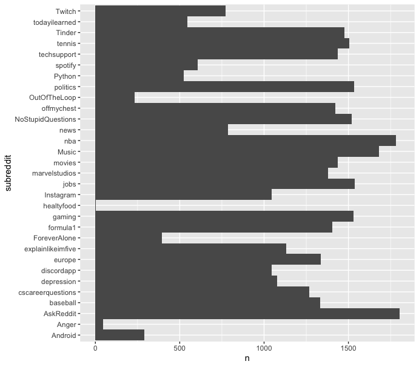
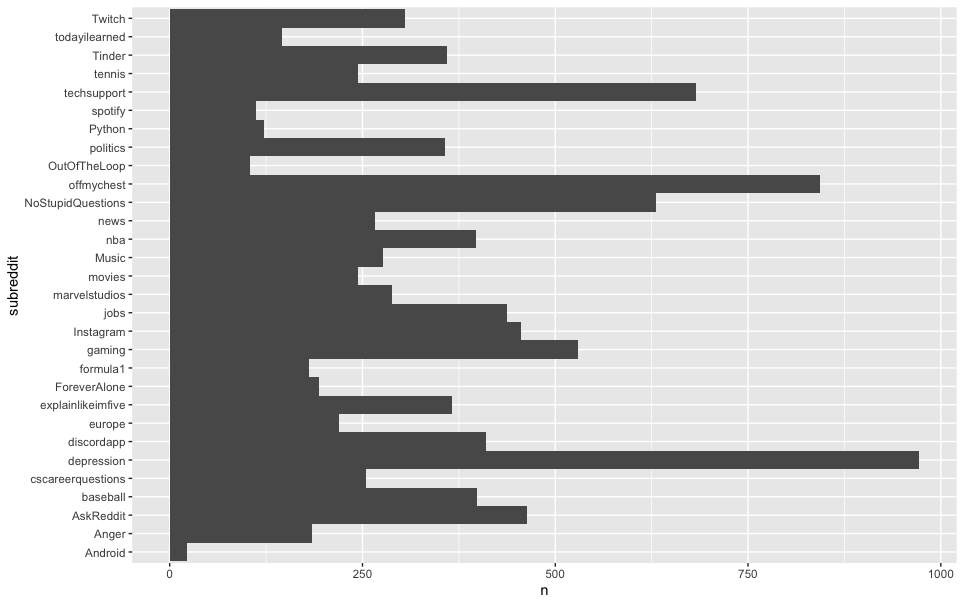
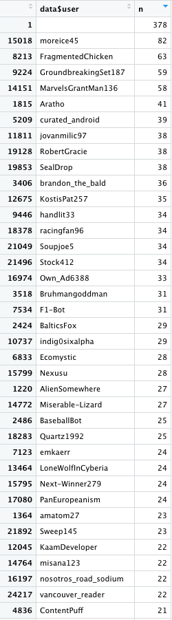

# Introduzione
L'obiettivo di questo progetto è stato realizzare ed analizzare un'architettura Big Data, impiegando conoscenze apprese e tecnologie studiate durante il corso.
L'architettura realizzata è la seguente:


- **Data source**: come fonte dei dati è stato scelto il forum "Reddit", esso permette agli utenti di pubblicare post relativi agli argomenti più disparati. La piattorma è strutturata in modo tale da separare i macro-argomenti nei cossiddetti "subreddit", ogni subreddit (che ha la sua pagina specifica) si contraddistingue dall'argomento che viene trattato all'interno dei post pubblicati dagli utenti.

- **Data ingestion / Message ingestion**: questa fase è stata gestita attraverso in primo luogo le API ufficiali offerte dalla piattaforma Reddit, successivamente attraverso uno scambio di messaggi Kafka è stato effettuato il salvataggio in locale dei dati recuperati. In questa fase è stato anche eseguito un processo di analisi del sentiment dei dati, dividendo quelli considerati come "postivi" da quelli "negativi".

- **Analytical Data Store**: la tecnologia scelta per memorizzare i dati recuperati è stata MongoDB, un database NoSQL Document-based. Una volta memorizzati, i dati sono subito pronti per la fase di analisi tramite query specifiche.

- **Analytics and Report**: le query di analisi sono state sviluppate utilizzando il linguaggio R, compatibile con MongoDB e molto efficiente. Oltre a ottenere i risultati delle query, R offre la possibilità di costruire in tempo reale dei grafici con i risultati ottenuti, per una loro comprensione più semplice e più immediata.

<br>

# Data Source
I dati recuperati sono stati relativi ai post di alcuni subreddit, questi subreddit sono stati selezionati in base alla loro popolarità e attività: la piattaforma mette a disposizione un sistema di classifica che segnala quali sono i subreddit più in voga al momento, cioè quelli con maggior affluenza di utenti e nuovi post giornalieri, selezionando questi subreddit in poco tempo si arriva ad avere un buon numero di dati da utilizzare in un'architettura big data. 

I subreddit scelti sono stati:

- [r/python](https://www.reddit.com/r/Python/)
- [r/cscareerquestions](https://www.reddit.com/r/cscareerquestions/)
- [r/news](https://www.reddit.com/r/news/)
- [r/nba](https://www.reddit.com/r/nba/)
- [r/spotify](https://www.reddit.com/r/spotify/)
- [r/jobs](https://www.reddit.com/r/jobs/)
- [r/tennis](https://www.reddit.com/r/tennis/)
- [r/movies](https://www.reddit.com/r/movies/)
- [r/offmychest](https://www.reddit.com/r/offmychest/)
- [r/depression](https://www.reddit.com/r/depression/)
- [r/foreveralone](https://www.reddit.com/r/ForeverAlone/)
- [r/anger](https://www.reddit.com/r/Anger/)
- [r/europe](https://www.reddit.com/r/europe/)
- [r/gaming](https://www.reddit.com/r/gaming/)
- [r/formula1](https://www.reddit.com/r/formula1/)
- [r/todayilearned](https://www.reddit.com/r/todayilearned/)
- [r/marvelstudios](https://www.reddit.com/r/marvelstudios/)
- [r/healtyfood](https://www.reddit.com/r/HealthyFood/)
- [r/politics](https://www.reddit.com/r/politics/)
- [r/askreddit](https://www.reddit.com/r/AskReddit/)
- [r/discordapp](https://www.reddit.com/r/discordapp/)
- [r/twitch](https://www.reddit.com/r/Twitch/)
- [r/tinder](https://www.reddit.com/r/Tinder/)
- [r/techsupport](https://www.reddit.com/r/techsupport/)
- [r/music](https://www.reddit.com/r/Music/)
- [r/android](https://www.reddit.com/r/Android/)
- [r/baseball](https://www.reddit.com/r/baseball/)
- [r/nostupidquestions](https://www.reddit.com/r/NoStupidQuestions/)
- [r/explainlikeimfive](https://www.reddit.com/r/explainlikeimfive/)
- [r/outoftheloop](https://www.reddit.com/r/OutOfTheLoop/)
- [r/instagram](https://www.reddit.com/r/Instagram/)

Questi subreddit appartengono a categorie molto diverse fra loro (news, attualità, sport, intrattenimento, salute, relazioni ecc.), questo perché può essere interessante confrontare realtà diverse e osservare come varia il comportamento e/o il sentimento generale di diverse comunità. Come fonti di dati si sono scelti sempre le pagine già filtrate per post più recenti, in modo da avere sempre nuovi post a disposizione.

<br>

# Data Ingestion / Message Ingestion
## Reddit API
Questa è la fase in cui i dati sono stati attivamente recuperati e salvati in un database locale. La prima fase è stata quella di recuperare i dati dalla piattaforma tramite le [API ufficiali](https://www.reddit.com/dev/api/). Reddit infatti permette agli utenti di scaricare dal sito post tramite delle semplici richieste GET; una volta creato un account apposito e recuperato le sue credenziali necessarie all'autenticazione, è possibile inviare delle richieste ai server di Reddit con alcune limitazioni: massimo 60 richieste al minuto, massimo 100 post per ogni richiesta, token di autenticazione valido per massimo 2 ore. Questi limiti però, almeno per questo tipo di progetto, non sono un problema, infatti con la possibilità di recuperare 6000 post al minuto non ci vuole molto per creare un database dal volume sufficiente per essere analizzato nell'ambito dei Big Data. Lo script di estrazione è stato lanciato più volte ma comunque a distanza di ore/giorni, questo perché anche nei subreddit più attivi con milioni di utenti, per avere un certo numero di nuovi post da aggiungere al database è stato opportuno aspettare che venissero effettivamente pubblicati.

Questa prima fase di estrazione dati è stata realizzata mediante un semplice script python, che consiste di tre parti principali:

1) Autenticazione
2) Estrazione dati (esempio a seguire)
```python
pythonSub = requests.get("https://oauth.reddit.com/r/python/new", headers=headers, params={'limit':'100'})
```
3) Salvataggio deli dati recuperati in file JSON, filtrando solo le informazioni utili agli scopi di analisi prefissati e invio sul canale kafka (questo script si comporta da producer, il consumer sarà lo script di sentiment)
```python
for response in responseData:
        for post in response.json()["data"]["children"]:
            dataPost = {
                'subreddit': post['data']['subreddit'],
                'user': post['data']['author'],
                'title': post['data']['title'],
                'selftext': post['data']['selftext'],
                'score': post['data']['score'],
                'time': post['data']['created_utc'],
                'commentsCount': post['data']['num_comments']
            }
            producer.send("reddit-posts-dev", dataPost)
```
<br>

## Sentiment analysis
Prima di salvare i dati su un database in locale, è stata effettuata un'analisi del sentiment per dividere i post negativi da quelli positivi. Ciò è stato fatto perché può essere utile monitorare l'andamento del sentiment generale e confrontare i vari subreddit da un punto di vista del coinvolgimento degli utenti.

Lo script di sentiment è stato realizzato sempre in python, con l'utilizzo della libreria [TextBlob](https://github.com/sloria/TextBlob), che offre un metodo basato su machine learning per processare in modo semplice un testo e assegnare uno score in base al sentiment registrato. L'analisi del sentiment è stata eseguita sul campo "title" dei post estratti, che è stato ritenuto il più adatto per estrapolare l'umore dell'autore.

Questo microservizio inizialmente consuma i messaggi dal canale kafka per ottenere accesso ai post estratti, successivamente esegue la sentiment analysis e infine sulla base del risultato ottenuto invia come producer un nuovo messaggio sul canale kafka su due topic diversi: "reddit-positive-dev" se lo score ottenuto è maggiore o uguale a 0, "reddit-negative-dev" altrimenti. Questa suddivisione di topic verrà utilizzata dal microservizio che si occupa di salvare i dati in un DB locale, effettivamente si avranno due database distinti, uno per i post considerati positivi, uno per quelli considerati negativi.

```python
if __name__ == '__main__':

    consumer = KafkaConsumer("reddit-posts-dev", auto_offset_reset='earliest',  
    enable_auto_commit=True, group_id=None,
                             value_deserializer=lambda x: loads(x.decode('utf-8')))

    producer = KafkaProducer(value_serializer=lambda v: json.dumps(v).encode('utf-8'))

    for message in consumer:

        message = message.value
        postText = message["title"] + message["selftext"]

        # converting to blob and sentiment analysis of the post
        blob = TextBlob(postText)
        sentiment = blob.sentiment.polarity

        message["scoreSentiment"] = sentiment

        # sending posts to other kafka microservices
        if sentiment >= 0:
            producer.send("reddit-positive-dev", message)
        else:
            producer.send("reddit-negative-dev", message)

```
<br><br>

# Analytical Data Store
## MongoDB
La tecnologia scelta per memorizzare i dati estratti è stata MongoDB, un sistema NoSQL document-based. Questa scelta è stata motivata principalmente da due fattori: in primo luogo le API ufficiali della piattaforma Reddit potrebbero cambiare, aggiornarsi e rendere disponibili nuovi tipi di informazioni, un database non relazionale come Mongo permette di aggiungere nuove colonne semplicemente e in modo scalabile, cosa che un database relazionale classico non può offrire.

Non è stato scelto un Key-Value database in quanto solitamente sistemi di questo tipo vengono utilizzati in casi in cui sono presenti dati relativi ad informazioni personali degli utenti e riguardo le loro sessioni all'interno delle piattaforme interessate, inoltre sono sconsigliati quando si eseguono query by data, cosa che invece fa parte degli obiettivi del progetto.

Database document-based, così come quelli column-family (per esempio Cassandra), sono consigliati nel caso in cui si debba interagire con piattaforme web per eseguire operazioni di analisi (entrambi i sistemi sono anche compatibili con R, tool molto usato per l'analisi). La decisione finale è stata indirizzata verso MongoDB prettamente per ragioni di maggiore dimestichezza nel suo utilizzo.
<br>

## Struttura del database
Come anticipato nella sezione relativa alla data ingestion (sotto-sezione Reddit API), i campi dei post recuperati che sono stati effettivamente estratti sono i seguenti:

| Campo  | Descrizione  |
|:---|:---|
| _id | Titolo del post utilizzato come id del record |
| _class  | Tipo di oggetto salvato, corrisponde al tipo della classe Java associata | 
| commentsCount  | Numero di commenti presenti sul post |
| score  | Score totale del post, differenza tra upvote e downvote dati dagli utenti |
| selftext  | Corpo del testo del post | 
| subreddit  | Subreddit in cui è stato postato il post |
| time  | Data del post |
| user  | Autore del post | 
| scoreSentiment  | Score registrato dalla funzione di sentiment (TextBlob) |

Si nota che come id è stato scelto il titolo, questo perché tra tutti i parametri è quello che ha maggiori probabilità di essere univoco ed inoltre la piattaforma Reddit impedisce agli autori dei post di modificarlo. In questo modo, nel caso in cui ci fosse poca attività in un subreddit, nel caso gli script di ingestion ripescassero di nuovo un post già salvato, esso verrebbe scartato garantendo l'assenza di duplicati nel database.

## Microservizi Java
Sono stati svilupatti due microservizi (questa volta in Java e non più Python) che si occupano di memorizzare i dati nel database locale. Sono due microservizi distinti in quanto si occupano di raccogliere i due diversi risultati ottenuti dallo script di sentimenti e inviati sul canale Kafka su due topic diversi: "reddit-positive-dev" e "reddit-negative-dev". Il primo microservizio raccoglie tutti i post considerati come positivi e li memorizza in un primo database, mentre il secondo microservizio tutti quei post considerati come negativi e li memorizza in un secondo database distinto.

Ciascun microservizio si interfaccia al sistema MongoDB appoggiandosi allo strumento offerto dalla libreria SpringBoot. Il supporto nativo di SpringBoot per i database di Mongo è stata una delle motivazioni per cui è stato scelto di utilizzare Java come linguaggio di programmazione di questi due microservizi.

A seguire il codice utilizzato in questi due microservizi, a titolo di esempio verrà mostrato quello relativo ai post "positivi":

<br>

1. **Model**
```java
@Getter @Setter
@NoArgsConstructor @AllArgsConstructor
@Builder @ToString
@Document(collection = "positive_reddit_posts")
public class RedditPost {

    private String id;

    private String subreddit;

    private String user;

    @Id
    private String title;

    private String selftext;

    private Float score;

    private Date time;

    private Float commentsCount;

    private Float scoreSentiment;

}
```

Viene definita una classe Java, "RedditPost", sarà utilizzata per tutti gli oggetti che verrano creati a partire dai messaggi ricevuti dal canale Kafka e che poi verranno memorizzati nel database. Tramite l'annotazione di SpringBoot **@Document** si segnala già che la classe sarà utilizzata per oggetti creati appositamente per essere salvati in un database Mongo.

<br>

2. **Messaging**

```java
@Slf4j
@Service
public class KafkaPositiveRedditListener {

    @Autowired
    private RedditPostService redditPostService;

    private static final String TOPIC_NAME = "reddit-positive-dev";

    @KafkaListener(topics = TOPIC_NAME, groupId = "group-id")
    public void consumeMessage(@Payload String post) {
        JSONObject jsonObj = new JSONObject(post);

        RedditPost r = RedditPost.builder()
                .title(jsonObj.getString("title"))
                .user(jsonObj.getString("user"))
                .commentsCount(jsonObj.getFloat("commentsCount"))
                .selftext(jsonObj.getString("selftext"))
                .subreddit(jsonObj.getString("subreddit"))
                .score(jsonObj.getFloat("score"))
                .time(new java.util.Date((long)jsonObj.getFloat("time")*1000))
                .scoreSentiment(jsonObj.getFloat("scoreSentiment"))
                .build();

        redditPostService.savePost(r);
        log.info(r.toString());
    }
```
Si prende dal canale Kafka tutti i messaggi inviati sul topic selezionato (in questo caso "reddit-positive-dev"). Ciascun messaggio viene elaborato come oggetto JSON, che viene deserializzato in un oggetto Java di tipo RedditPost, i cui attributi saranno proprio i campi selezionati precedentemente durante la fase di ingestion. A questo punto ogni oggetto creato viene salvato all'interno di una repository (se ne occuperà Service).

<br>

3. **Service**

```java
@Service
public class RedditPostService {

    @Autowired
    private ReddItPostRepository reddItPostRepository;

    public void savePost(RedditPost redditPost){
        reddItPostRepository.save(redditPost);
    }

    public List<RedditPost> retrieveAllPost(){
        return reddItPostRepository.findAll();
    }
}
```
La classe Service viene utilizzata come di consueto in un'architettura SpringBoot per salvare oggetti all'interno di repository e quindi database, sono quindi presenti il metodo "save(RedditPost)" e "retrieveAllPost()", il primo si occupa del salvataggio degli oggetti (sovrascrivendo quello di default in modo che accetti oggetti di tipo RedditPost) mentre il secondo può essere utile per future operazioni di analisi.

<br><br>

# Analytics and Report
Per la fase di analisi dei dati estratti, si è ipotizzato di dover confrontare i vari subreddit fra di loro, cercando di osservare differenze per quanto riguarda la popolarità di certi argomenti, quali possano essere quelli attrivuibili ad umori più positivi e quali più negativi, osservando inoltre se la risposta da parte di ciascuna community rispecchia quei determinati umori.

La tecnologia scelta per questa fase è stato il linguaggio R, questa decisione è stata presa sulla base del gran numero di strumenti offerti dal linguaggio, sia dal punto di vista delle query realizzabili sia per il fatto che, tramite l'IDE ufficiale RStudio è possibile visualizzare in tempo reale grafici di semplice interpretazione riguardo le query eseguite. Inoltre, R offre compatibilità completa con l'infrastruttura MongoDB, garantendo alta efficienza.

## **Analisi**

### 1. subredditByScore/Comments
La prima analisi effettuata è stata quella di confrontare l'approvazione dei post positivi e quella dei negativi, osservando quali subdreddit fossero più sbilanciati in un senso in un database, anche in relazione alla loro controparte nell'altro DB.
<br>
Per fare ciò è stata realizzata una query che eseguisse una media di Score e numero di commenti dei post, raggruppati per subreddit di appartenenza. Questo perché se un post ha uno Score alto e/o un alto numero di commenti, è probabile che gli altri utenti della community condividano opinioni e umori degli autori dei post.

```R
subredditByScore = aggregate(data$score, by=list(Category=data$subreddit), FUN=mean)

ggplot(subredditByScore, aes(x=x, y=Category)) + geom_bar(stat='identity', width=1)
```

|  |
|:--:|
| <b>Positive subredditByScore</b>|

<br><br>

|  |
|:--:|
| <b>Negative subredditByScore</b>|

<br><br><br><br>

```R
subredditByComments = aggregate(data$commentsCount, by=list(Category=data$subreddit), FUN=mean)

ggplot(subredditByComments, aes(x=x, y=Category)) + geom_bar(stat='identity', width=1)
```


|  |
|:--:|
| <b>Positive subredditByComments</b>|

<br><br>

|  |
|:--:|
| <b>Negative subredditByComments</b>|

<br><br><br><br><br>

### 2. maxScorePost/minScorePost
La seconda analisi mira a estrarre quale post ha ottenuto uno score maggiore/minore, per ogni subreddit. Ciò può essere utile per capire che tipologie di post sono più in voga all'interno di ogni community e che argomenti vengono trattati all'interno di questi post, o viceversa quali sono gli argomenti da non trattare.

```R
group <- as.data.table(data)

maxScorePost <- group[group[, .I[which.max(score)], by=subreddit]$V1]
```

|  |
|:--:|
| <b>Dettagli dei post positivi che hanno ottenuto score maggiore in ogni subreddit</b>|

<br><br>

|  |
|:--:|
| <b>Dettagli dei post negativi che hanno ottenuto score maggiore in ogni subreddit</b>|

<br><br>

```R
group <- as.data.table(data)

minScorePost <- group[group[, .I[which.min(score)], by=subreddit]$V1]
```

|  |
|:--:|
| <b>Dettagli dei post positivi che hanno ottenuto score minore in ogni subreddit</b>|

<br><br>

|  |
|:--:|
| <b>Dettagli dei post negativi che hanno ottenuto score minore in ogni subreddit</b>|

<br><br><br><br><br>

### 3. subredditCount
La terza analisi si è incentrata sull'osservare quale fosse il subreddit più presente all'interno di un databse specifico, per monitorare quindi se un certo subreddit contiene più post positivi o negativi.

```R
subredditCount = count(data, subreddit = data$subreddit)

ggplot(subredditCount, aes(x=n, y=subreddit)) + geom_bar(stat='identity', width=1)
```

|  |
|:--:|
| <b>Positive subredditCount</b>|

<br><br>

|  |
|:--:|
| <b>Negative subredditCount</b>|

<br><br><br><br><br>

### 4. mostPositiveUsers/mostNegativeUsers
La quarta analisi mira a scoprire quali utenti sono più presenti all'interno di diversi subreddit, ciò può essere utile ad identificare quali subvreddit possono avere una community condivisa e quindi più interazioni tra gli stessi utenti o comunque tra utenti con interessi/opinioni comuni.

```R
#nel database dei post positivi
mostPositiveUser = count(data, data$user)

#nel database dei post negativi
mostNegativeUser = count(data, data$user)
```

mostPositiveUser             |  mostNegativeUser 
:-------------------------:|:-------------------------:
  |  